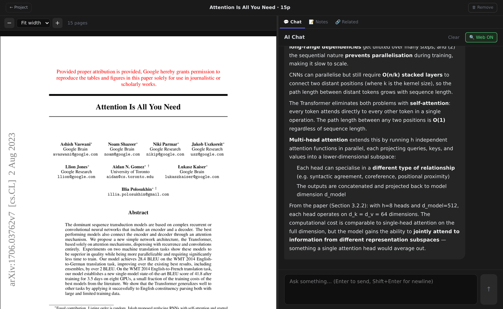
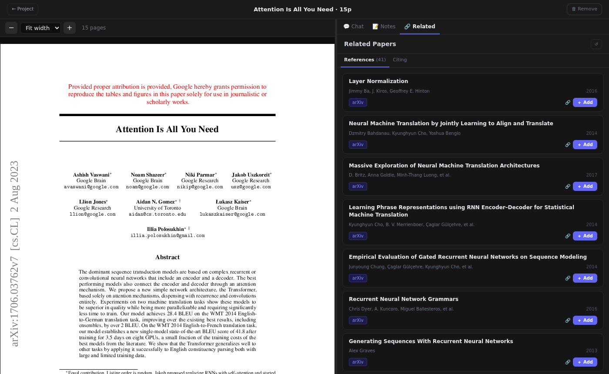
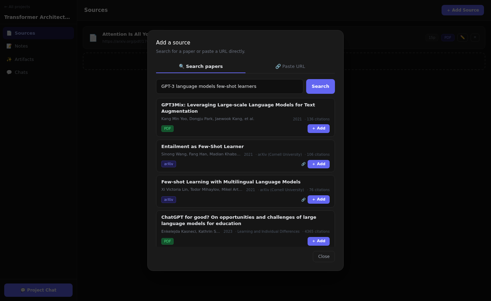
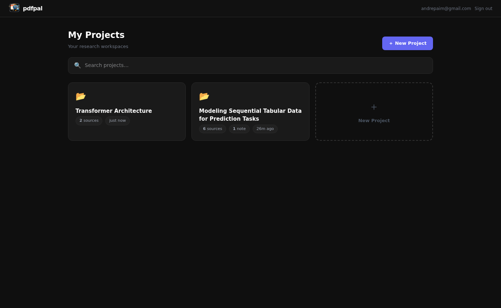

# pdfpal

> Read research papers and chat with them inline — PDF viewer and AI side by side, no tab-switching. Self-hosted, powered by your Claude subscription.

---

## Screenshots

<div align="center">

| PDF reader + AI chat | Related papers |
|:---:|:---:|
|  |  |
| Read the paper and ask questions inline — no tab-switching | Browse references and citations from Semantic Scholar; add any paper in one click |

| Paper search | Projects |
|:---:|:---:|
|  |  |
| Search by title across OpenAlex + arXiv and add papers directly to your project | Organise your research into projects — each with sources, notes, artifacts, and chat |

</div>

---

## Why I Built This

I was looking for a tool to chat with research papers — something with an inline reader so I wouldn't have to context-switch between a PDF tab and an AI tab. Tools like [ChatPDF](https://www.chatpdf.com/) do exactly that. They work well.

But every option I found follows the same pattern: a free tier that's too restrictive for real use, and a paid tier that adds another monthly subscription on top of the VPS and Claude Max subscription I'm already paying for. And even then, you're locked into whatever model and feature set they've decided to ship.

So I cut out the middleman.

pdfpal runs entirely on your own server. Every chat, every cross-paper query, every question goes through the Claude CLI using your existing subscription. No extra monthly fee, no usage caps, no feature gates.

And there's one more thing no SaaS can offer: I have an OpenClaw agent running on the same VPS. Any feature I want, any workflow quirk — I can just ask it to build it. Finding the perfect research app is impossible. Building it iteratively, exactly the way I want it, isn't.

---

## Features

### Reading & Chat
- **Split-pane reader** — PDF viewer on the left, chat/notes/related on the right; resizable
- **Per-source chat** — persistent conversation history per paper, restored across sessions; renders math equations (KaTeX)
- **Text selection → chat** — select any text in the PDF to pre-fill the chat input
- **Source notes** — markdown notes scoped to a specific paper; auto-save, live preview
- **Related papers** — References and Citations from Semantic Scholar; one click to add any paper to the project

### Sources & Search
- **Paper search** — search OpenAlex + arXiv by title; results show authors, year, venue, citation count; one click to add to a project
- **Smart PDF resolver** — paste any URL: arXiv, OpenReview, ACL Anthology, PMLR, Nature, Springer, DOI links, or a direct `.pdf` URL; tracking params stripped automatically
- **Open-access fallback** — for paywalled URLs, queries Semantic Scholar and Unpaywall for a free copy
- **Inline renaming** — rename projects and sources in-place
- **Failed source detection** — sources with no extracted text show a `⚠ Failed` badge with a one-click retry

### Projects
- **Project chat** — chat across multiple sources simultaneously; toggle which sources are in context
- **Notes** — project-level markdown notes with auto-save and live preview
- **Artifacts** — save AI-generated outputs as reusable documents; export as `.md`
- **Chats tab** — browse all chat sessions (per-source and project-level) in one place
- **Clear chat** — wipe a conversation from both UI and DB

### Infrastructure
- **Web search** — toggleable Tavily-powered search injects live results into every conversation
- **Chat persistence** — all conversations persisted in SQLite, restored on reload
- **Google OAuth** — private by default; only allowlisted emails can log in
- **Dark theme** — easy on the eyes

---

## Stack

| Layer | Tech |
|---|---|
| Frontend | React + TypeScript + Vite + Tailwind CSS |
| PDF rendering | react-pdf (pdfjs) |
| Markdown | react-markdown + remark-gfm + KaTeX |
| Backend | FastAPI + Python |
| Database | SQLite |
| PDF extraction | pdfplumber |
| AI | Claude CLI (`claude --print`) |
| Web search | [Tavily](https://tavily.com) |
| Paper search | [OpenAlex API](https://openalex.org) + arXiv |
| Related papers | [Semantic Scholar API](https://www.semanticscholar.org/product/api) |
| Auth | Google OAuth2 + JWT session cookie |

---

## Architecture

```
Browser (React SPA)
├── ProjectsPage       — list/create/delete/search projects
├── ProjectView        — sources / notes / artifacts / chats tabs
│   ├── SourcesTab     — add URLs, inline rename, failed badge + retry
│   ├── NotesTab       — project-level markdown notes
│   ├── ArtifactsTab   — saved AI outputs + .md export
│   └── ChatsTab       — all chat sessions for this project
├── PaperReader        — split-pane PDF viewer
│   ├── Chat tab       — persistent per-source conversation
│   ├── Notes tab      — source-scoped markdown notes
│   └── Related tab    — Semantic Scholar references + citations
└── ProjectChat        — multi-source chat with source toggles
         │
         ▼
   FastAPI backend (port 8200)
         │
   ├── POST /extract                         → resolve URL + extract PDF → save source
   ├── GET  /proxy-pdf?url=...               → CORS-safe PDF proxy
   ├── POST /chat                            → Tavily search + Claude CLI → SSE stream
   ├── GET|DELETE /projects/{id}/chat        → project-level chat history / clear
   ├── GET        /projects/{id}/chats       → list all chat sessions
   ├── GET|DELETE /projects/{id}/sources/{sid}/chat   → source chat history / clear
   ├── GET        /projects/{id}/sources/{sid}/related → Semantic Scholar lookup (cached)
   ├── GET  /projects                        → CRUD: projects, sources, notes, artifacts
   ├── GET  /auth/google                     → OAuth redirect
   ├── GET  /auth/google/callback            → OAuth callback + session cookie
   ├── GET  /auth/me                         → current user
   └── POST /auth/logout                     → clear cookie
```

---

## Self-hosting

### Requirements

- Python 3.10+
- Node.js 18+
- [Claude CLI](https://claude.ai/code) installed and authenticated
- A Google Cloud project with OAuth 2.0 credentials
- (Optional) [Tavily API key](https://tavily.com) for web search

---

### 1. Clone

```bash
git clone https://github.com/andrepaim/pdfpal.git
cd pdfpal
```

---

### 2. Set up Google OAuth

1. Go to [console.cloud.google.com](https://console.cloud.google.com)
2. Create or select a project
3. Navigate to **APIs & Services → Credentials**
4. Click **+ Create Credentials → OAuth 2.0 Client ID**
5. Application type: **Web application**
6. Under **Authorized redirect URIs**, add:
   ```
   https://your-domain.com/auth/google/callback
   ```
7. Note your **Client ID** and **Client Secret**

---

### 3. Configure environment

```bash
cp backend/.env.example backend/.env
```

Edit `backend/.env`:

```env
# AI
CLAUDE_BIN=/usr/local/bin/claude       # path to claude CLI binary

# Web search (optional)
TAVILY_API_KEY=your_tavily_key_here    # leave empty to disable web search

# Google OAuth
GOOGLE_CLIENT_ID=your_client_id_here
GOOGLE_CLIENT_SECRET=your_client_secret_here
ALLOWED_EMAILS=you@gmail.com           # comma-separated allowlist

# Session
SESSION_SECRET=generate-a-random-secret-here   # openssl rand -hex 32
PUBLIC_URL=https://your-domain.com
```

---

### 4. Install dependencies

```bash
pip install -r backend/requirements.txt

cd frontend && npm install && npm run build && cd ..
```

---

### 5. Run

**Production:**
```bash
cd backend && uvicorn main:app --host 0.0.0.0 --port 8200
```

**Development (hot reload):**
```bash
# Terminal 1
cd backend && uvicorn main:app --reload --port 8200

# Terminal 2
cd frontend && npm run dev
```

---

### 6. Systemd service (Linux)

```bash
sudo cp clawd-reader.service /etc/systemd/system/
# Edit User, Group, and paths in the service file
sudo systemctl daemon-reload
sudo systemctl enable --now clawd-reader
```

---

### 7. Reverse proxy (Apache)

```apache
<VirtualHost *:443>
    ServerName your-domain.com
    SSLEngine On
    SSLCertificateFile    /etc/letsencrypt/live/your-domain.com/fullchain.pem
    SSLCertificateKeyFile /etc/letsencrypt/live/your-domain.com/privkey.pem
    ProxyPreserveHost On
    ProxyTimeout 600
    ProxyPass        / http://127.0.0.1:8200/
    ProxyPassReverse / http://127.0.0.1:8200/
</VirtualHost>
```

---

### Deploy updates

```bash
bash deploy.sh
```

---

## Usage

1. Sign in with your allowlisted Google account
2. Create a **Project** for your research topic
3. Add sources by pasting a PDF URL (arXiv, DOI, direct PDF, etc.)
4. Click **＋ Add Source** to search by title or paste a URL directly
5. Click a source to open the **PDF reader**:
   - **💬 Chat** — ask questions about the paper; history persists
   - **📝 Notes** — take markdown notes scoped to this paper
   - **🔗 Related** — browse references and citations; add any paper to the project in one click
6. Use **💬 Project Chat** to ask questions across multiple sources at once
7. Take project-level **Notes** in markdown — auto-saved
8. Save AI responses as **Artifacts**, then export as `.md`
9. Browse all past conversations in the **Chats** tab

---

## Limitations

- PDFs with more than **50 pages** are not supported (truncation planned)
- **Scanned PDFs** (image-only, no text layer) return empty text — OCR not implemented
- Some publishers (ACM, Elsevier) block automated access; the resolver tries Semantic Scholar and Unpaywall as fallbacks but cannot bypass paywalls with no open-access copy
- Semantic Scholar Related Papers requires a recognizable arXiv ID or DOI in the source URL
- Claude CLI response is buffered — no true token-by-token streaming

---

## Roadmap

- [ ] RAG chunking for large PDFs (>50 pages)
- [ ] OCR for scanned PDFs (Claude vision)
- [ ] Global search across all projects and sources
- [ ] Semantic Scholar API key for higher rate limits on Related Papers lookup
- [ ] Highlight PDF passages cited in answers
- [ ] True streaming (replace `claude --print` with direct API)
- [ ] Local LLM support (Ollama)

---

## License

MIT
