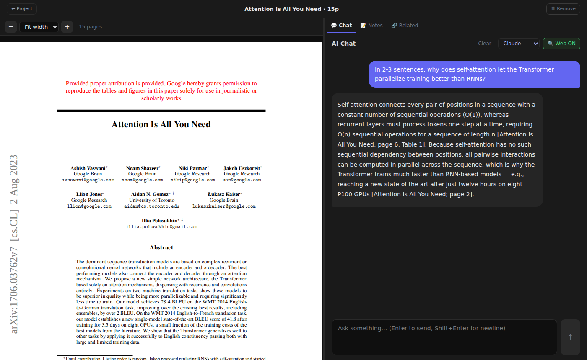
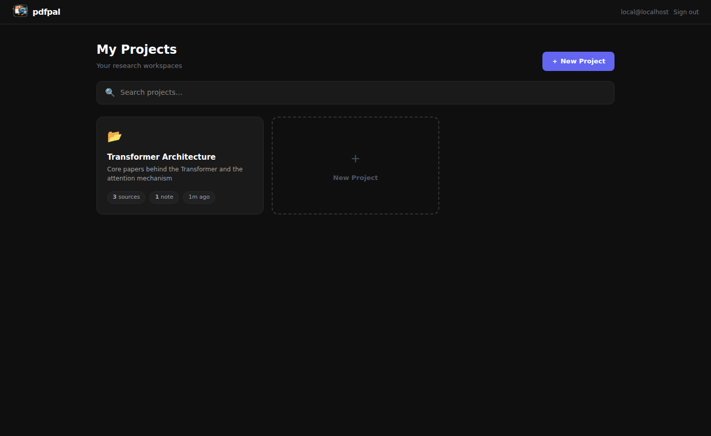
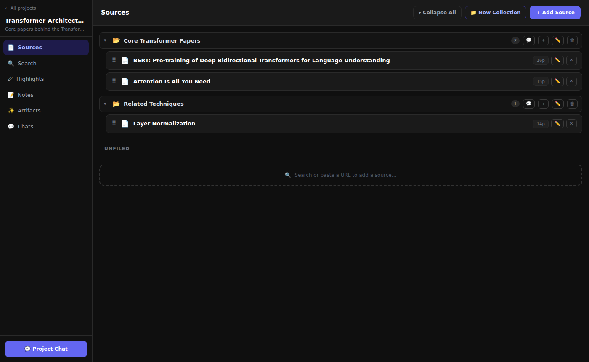
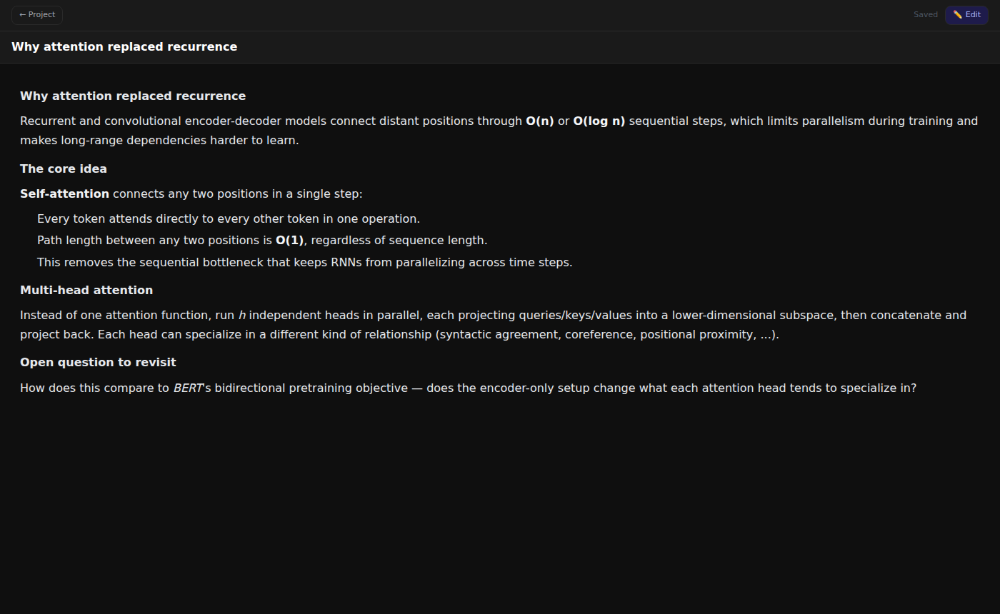
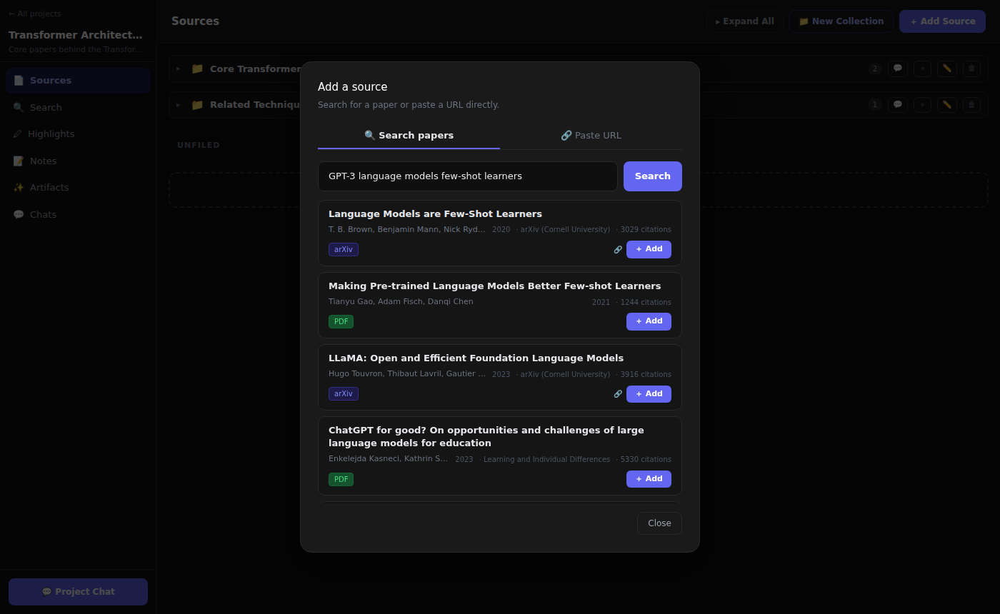
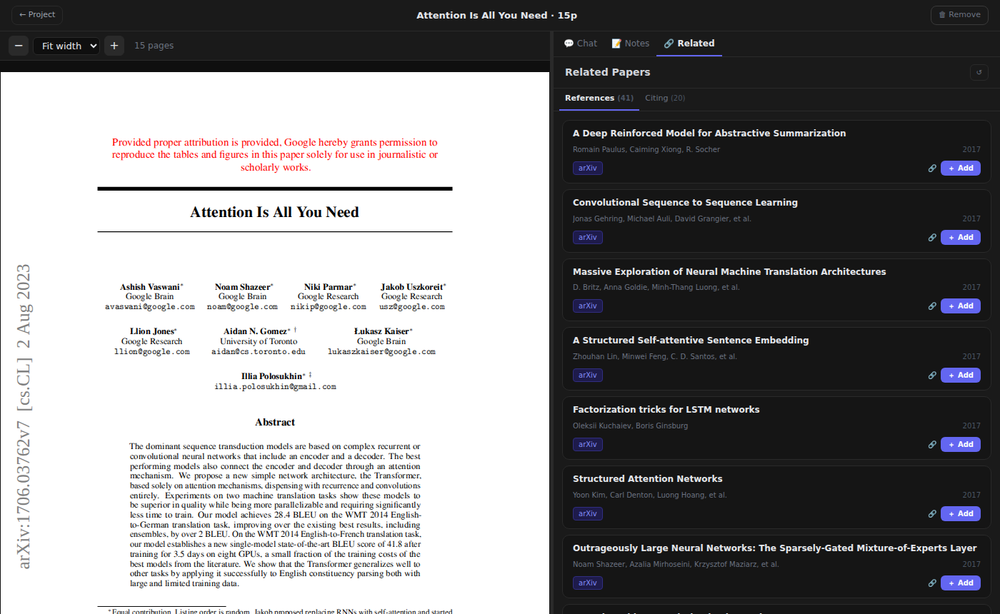

# pdfpal

> **AI to read deeper, not to avoid reading.**

An inline PDF reader with AI chat, notes, and highlights side by side, plus a scriptable CLI an AI agent can drive on its own. Runs entirely on your machine, powered by your existing Claude, Codex, or OpenCode subscription. No SaaS fee, no usage cap, no account.

There's a lot of vibe researching going on. Feed the PDF to a chatbot and ask for the gist, watch the 20-minute YouTube explainer, skim an AI-generated summary, then walk away feeling like you read the paper. You didn't. The understanding that matters lives in exactly the parts the summary flattens: the assumptions, the derivation the author skipped, the limitation buried in section 6, the table that quietly contradicts the abstract. If your grasp of a paper ends where a summary does, you don't have one.

But the answer isn't to pretend it's five years ago: print the paper, read it alone, hit a wall on page 4 (notation you forgot, a step "left as an exercise", background the author assumes you have) and either suffer through it or quietly give up. That suffering was never the point. pdfpal is the middle ground: you read the actual paper, and AI sits next to the page, unpacking the passage you're stuck on, answering questions grounded in the text instead of vibes, keeping you reading instead of pretending.

<div align="center">

| Read and chat, side by side | Your research, organized |
|:---:|:---:|
|  |  |
| Ask questions about the paper you're reading, with no tab-switching | Projects, collections, notes, and chat history, all in one place |

</div>

## Isn't this already a thing?

Sort of. There are plenty of chat-with-PDF tools: web apps where you upload a paper and ask questions, AI assistants bolted onto PDF readers, notebook tools that summarize your sources. If you've tried one, you know the pattern: a free tier capped at a couple of documents or a few dozen pages, and a paid tier that stacks one more monthly subscription on top of the Claude, Codex, or OpenCode plan you already pay for. And your library lives in their cloud, not on your machine.

Most of them are also built around the summary: upload, get the takeaways, move on. That's the vibe-researching workflow. pdfpal is built around the reader.

pdfpal cuts out the middleman. It runs entirely on your machine, and every chat, every cross-paper question, goes through the agent CLI you've already got installed and authenticated. No extra fee, no usage caps, no feature gates, no uploads to anyone's cloud.

It's also a CLI with the same project/source/collection model as the web app (the browser and the CLI call the same core code, nothing is reimplemented twice), plus a Claude Code / Codex skill that lets an agent drive the whole thing directly. Here's what that looks like end to end.

## Research with an agent, then read

Finding papers is legwork, and by now agents are better at it than we are: they sweep the literature, follow citation trails, and triage abstracts faster than anyone with twelve tabs open. Reading is the part that's still yours. So pdfpal splits the job: give an agent a topic and it searches on its own, drives the pdfpal CLI through the [Agent skill](#agent-skill-claude-code--codex), and hands you back a project with the papers already fetched, filed into collections, and ready to read.

1. **Ask an agent** (Claude Code, Codex, or anything that can load the skill):

   > Research recent approaches to efficient attention mechanisms, create a pdfpal project called "Efficient Attention", and add the best papers you find.

2. **The agent finds the papers with its own tools**, then drives the real CLI to build the project. This is genuinely what it runs, not a mockup:

   ```bash
   pdfpal --json project create "Efficient Attention"
   pdfpal --json source add <project-id> "https://arxiv.org/abs/1706.03762"
   pdfpal --json source add <project-id> "https://arxiv.org/abs/2009.06732"
   pdfpal --json collection create <project-id> "Core Papers"
   pdfpal --json source file <project-id> <source-id> <collection-id>
   ```

3. **Open it in the browser**, already organized into collections:

   

4. **Read and ask questions inline**, in the same reader shown above, right where the agent left off.

## Features

### Reading & Chat
- **Split-pane reader**: PDF viewer on the left, chat/notes/related on the right; resizable.
- **Per-source chat**: persistent conversation history per paper, restored across sessions; renders math (KaTeX); web research is handled by the selected agent when supported.
- **Text selection → ask or highlight**: stuck on a passage? Select it and ask about it right there, grounded in the paper, or save it as a highlight.
- **Project chat**: ask across multiple sources at once, toggle which sources are in context, or scope to a single collection.

### Organization
- **Projects**: workspaces for a research topic: sources, notes, chat history.
- **Collections**: nested folders for organizing sources within a project; drag-and-drop, Expand/Collapse All.
- **Notes**: markdown notes at the project or source level, rendered by default, edit in place:

  
- **Highlights**: every annotation across a project, grouped by source, one click back to context.

### Sources & Discovery
- **Paper search**: search OpenAlex by title, one click to add:

  
- **Related papers**: references and citations from Semantic Scholar for any source, one click to add:

  
- **Smart PDF resolver**: paste any URL: arXiv, OpenReview, ACL Anthology, PMLR, a DOI link, or a direct `.pdf`; tracking params stripped automatically.
- **Project-wide full-text search**: SQLite FTS5 across every already-indexed source.
- **Managed local copies**: PDFs are copied locally; falls back to the source URL if a managed copy is deleted.

### CLI & Agent Automation
- **Full CLI**: every action above is also a `pdfpal` command, with `--json` for scripting.
- **Claude Code / Codex skill**: let an agent drive projects, sources, collections, and notes directly (see below).

## Requirements

- Node.js 22 or newer.
- One supported agent CLI installed and authenticated: `claude`, `codex`, or `opencode`.
- The selected agent may use its own built-in web-search tools, depending on the agent and its configuration.

## Install and run

```bash
npm install -g pdfpal
pdfpal
```

Running `pdfpal` starts the local Fastify server at `http://localhost:8200` and opens the browser. Use `pdfpal serve --no-open` to suppress the browser.

For development:

```bash
npm ci
npm run build
npm start
```

## Quickstart

1. Click **New Project** and give it a title.
2. Click **Add Source** and paste a paper URL (arXiv, OpenReview, ACL Anthology, PMLR, a DOI link, or a direct `.pdf`), or search by title.
3. Open the source, select the passage you're stuck on to ask about it, or save it as a highlight.
4. Switch to the **Notes** tab and write what you understood in your own words as a markdown note; it renders as you read it back.
5. Ask a question across every source in the project from **Project Chat**.

## CLI

```bash
pdfpal project create "My Research"
pdfpal source add "My Research" https://arxiv.org/abs/1706.03762
pdfpal collection create "My Research" "Core Papers"
pdfpal source list "My Research"
pdfpal note create "My Research" -t "Summary" -c "Key findings..."
pdfpal ask "My Research" "Compare the main methods"
```

Commands accept a UUID or an exact case-insensitive title. Ambiguous titles are rejected. Add `--json` for machine-readable output. `pdfpal ask <project>` reads the question from stdin when the question argument is omitted.

## Agent skill (Claude Code / Codex)

`skills/pdfpal-cli/` documents the full CLI (flags, exit codes, selector rules) so an agent can drive it directly; see [Research with an agent, then read](#research-with-an-agent-then-read) above for what that looks like in practice. It does not search for papers itself; that's the agent's job, using its own tools.

Install it for both Claude Code and Codex (symlinks into `~/.claude/skills/` and `~/.codex/skills/`):

```bash
npm run skill:install
```

Run `npm run skill:uninstall` to remove the symlinks.

## Local data

pdfpal uses `~/.pdfpal` by default:

```text
~/.pdfpal/
├── config.json
├── pdfpal.db
├── files/       # managed PDF copies
└── backups/     # automatic pre-migration database backups
```

New PDFs are copied into `files/`, while extracted text and FTS chunks live in SQLite. If a managed PDF is removed and the source has a URL, the reader downloads and renders the remote PDF without recreating the copy.

Existing databases are migrated in place after an automatic backup. Override the data directory with `PDFPAL_DATA_DIR` or only the database path with `PDFPAL_DB`.

## Configuration

Configuration precedence is command flags, environment variables, `~/.pdfpal/config.json`, then defaults.

```bash
PDFPAL_AGENT=claude       # claude | codex | opencode
CLAUDE_BIN=claude
CODEX_BIN=codex
OPENCODE_BIN=opencode
PDFPAL_MODEL=
PDFPAL_PORT=8200
PDFPAL_DB=
SEMANTIC_SCHOLAR_API_KEY=
```

`SEMANTIC_SCHOLAR_API_KEY` is optional. Semantic Scholar's unauthenticated API shares a small rate limit across every caller on your network, not just you. A [free key](https://www.semanticscholar.org/product/api#api-key-form) is scoped to your own app instead and raises the limit substantially. Used for Related Papers and clean titles for arXiv/DOI links.

Legacy `~/.pdfpal/config.env` is imported automatically on first TypeScript startup.

## Development and tests

```bash
npm run typecheck
npm test
npm run build
cd frontend && npx playwright test
```

`npm test` runs Node's test runner through `tsx`, fails when no tests are found, and enforces the configured c8 coverage thresholds. Playwright starts the compiled Fastify server using an isolated temporary data directory. Set `PLAYWRIGHT_EXECUTABLE_PATH` to use a system Chromium installation.

### Project loops

Reusable agent workflows for this repository live in [`LOOPS.md`](LOOPS.md). [Loopy](https://signals.forwardfuture.com/loop-library/) is optional contributor tooling and is not required to build or run pdfpal.

```bash
npx skills add Forward-Future/loopy --skill loopy -g
```

Run the saved local test-quality workflow with:

```text
$loopy run the saved Local test-quality pass loop
```

## Architecture

The browser and CLI are two entry points over the same TypeScript services. The browser reaches those services through Fastify over HTTP; the CLI calls them directly. Both paths share configuration, storage, retrieval, chat history, and agent adapters.

```text
React SPA ── HTTP ──▶ Fastify API ──┐
                                    ├── TypeScript core
pdfpal CLI ─────────────────────────┘          │
                                              ├── Projects, sources, collections, notes, chat
                                              ├── SQLite + FTS5 retrieval and history
                                              ├── Managed PDF copies and extracted text
                                              ├── Claude / Codex / OpenCode subprocesses
                                              └── OpenAlex / Semantic Scholar integrations
```

### Main data paths

- **Ingest**: `SourceService` resolves a local file or URL, extracts its text, stores a managed PDF copy, and chunks/indexes the text in SQLite FTS5.
- **Ask**: `ChatService` scopes retrieval by project, source, or collection, builds a grounded prompt from matching passages, invokes the selected agent CLI, and persists the answer and source references.
- **Use**: React pages call the Fastify API; CLI commands and [`skills/pdfpal-cli`](skills/pdfpal-cli/) automate the same core operations. An agent subprocess may use its own web-search tools when supported by that agent.

The implementation follows that split:

- [`frontend/src`](frontend/src/) contains the reader, chat, projects, notes, collections, and source-discovery UI.
- [`src/server`](src/server/) exposes the HTTP API and serves the built frontend.
- [`src/cli`](src/cli/) defines the scriptable `pdfpal` commands.
- [`src/core`](src/core/) owns projects, sources, collections, notes, retrieval, chat, PDF handling, configuration, and agent invocation.

The npm package contains the compiled TypeScript server/CLI and the built React frontend. Runtime state stays local under `~/.pdfpal` by default, while external network edges are limited to source URLs, OpenAlex, Semantic Scholar, and capabilities provided by the selected agent. It is intended for local, single-user operation.

*AI to read deeper, not to avoid reading.*
